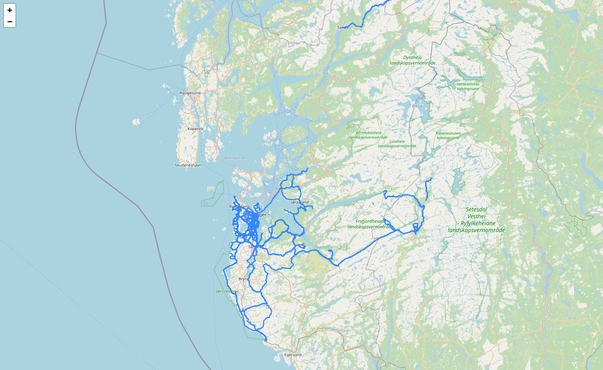

# GPX Heatmap

Create a dynamic map with the heatmap of your GPX files.



# Use

Set the variable `root` to the parent directory where your GPX files are saved.
A recursive search is made in all sub-directories for GPX files.

# FIT files - Strava, Garmin, Suunto, etc...

[GPSBabel](https://www.gpsbabel.org/) was used to convert all FIT files to GPX format.
See the support script in Bash to perform that action.

# TODO

 - [ ] Add a check if the GPX file is empty.

# Requirements

```
gpxpy
folium
numpy
```

